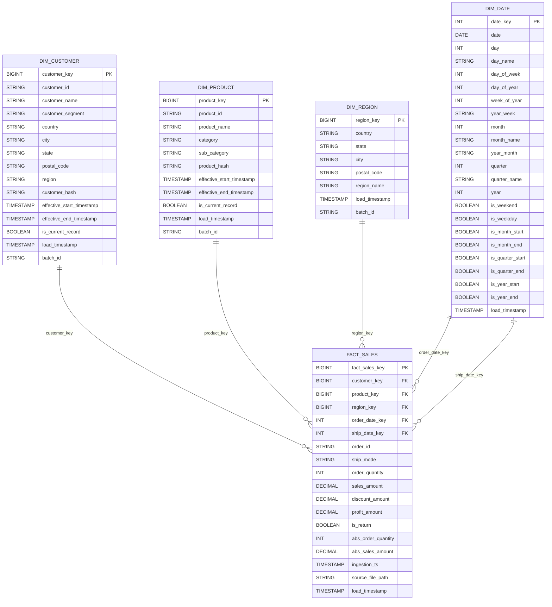

# GlobalMart Retail Analytics on Databricks

End-to-end retail analytics pipeline built on Databricks using a Medallion Architecture (`Bronze -> Silver -> Gold`) and consumed in Power BI.

## Project Overview

This project processes GlobalMart retail data into analytics-ready models for reporting and business insights:

- Bronze: raw ingestion and landing
- Silver: cleaned and conformed dimensional model
- Gold: business views for KPI and dashboard use cases
- Power BI: semantic/reporting layer connected to Gold outputs

## Repository Structure

```text
Bronze/
  bronze_ingestion.ipynb

Silver/
  dim_customer.ipynb
  dim_product.ipynb
  dim_region.ipynb
  dim_date.ipynb
  fact_sales.ipynb

Gold/
  1_sales_base.ipynb
  2_vw_profitability.ipynb
  3_vw_logistics_efficiency.ipynb
  4_vw_customer_value.ipynb
  5_vw_sales_base_masked.ipynb
  old_vw_script.ipynb

PowerBIReports/
  Gimball Retail GlobalMart Project.pbix
  databricks-Serverless Starter Warehouse.pbids
```

## Data Flow

1. `Bronze/bronze_ingestion.ipynb`
   Loads raw source data to Bronze tables with ingestion metadata.
2. Silver dimension notebooks
   Builds `dim_customer`, `dim_product`, `dim_region`, and `dim_date`.
3. `Silver/fact_sales.ipynb`
   Creates the central fact table and links to conformed dimensions.
4. Gold notebooks
   Creates analytics views for profitability, logistics, and customer value.
5. Power BI
   Connects to Gold outputs for dashboarding and stakeholder reporting.

## Suggested Execution Order

Run notebooks in this order to avoid dependency issues:

1. `Bronze/bronze_ingestion.ipynb`
2. `Silver/dim_customer.ipynb`
3. `Silver/dim_product.ipynb`
4. `Silver/dim_region.ipynb`
5. `Silver/dim_date.ipynb`
6. `Silver/fact_sales.ipynb`
7. `Gold/1_sales_base.ipynb`
8. `Gold/2_vw_profitability.ipynb`
9. `Gold/3_vw_logistics_efficiency.ipynb`
10. `Gold/4_vw_customer_value.ipynb`
11. `Gold/5_vw_sales_base_masked.ipynb`

## Tech Stack

- Databricks Notebooks
- Apache Spark / PySpark
- Delta Lake (typical for Databricks Medallion projects)
- Power BI

## Entity Relationship Diagram (Silver Layer)



## How to Use This Repository

- Import notebooks into your Databricks workspace.
- Configure storage paths, catalog/schema names, and secrets as needed.
- Execute notebooks in the suggested order.
- Validate Gold layer outputs.
- Open `PowerBIReports/Gimball Retail GlobalMart Project.pbix` and point it to your Databricks warehouse.

## Notes

- `Gold/old_vw_script.ipynb` appears to be legacy and may not be required in the main run.
- Update this README with environment-specific details (catalog, schema, cluster/warehouse config) for production use.
